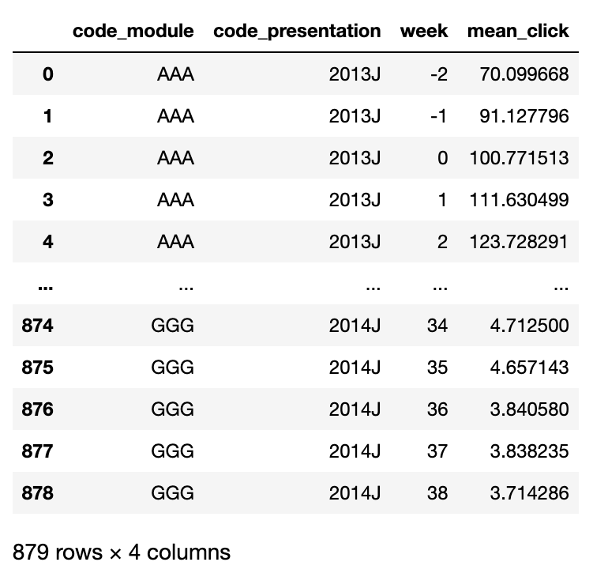

# Open University Learning Analytics 
This repository dives into the Open University Learning Analytics Dataset (OULAD). It includes visualizations and tables on EDA to look at student activity, code to prepare the data and build predictive models. 

**The ultimate question we want to predict is a students' likelihood of failing a course.**

Below is the OULAD database schema:

## EDA 
- We want to look at the outcomes for each student in a course. The feature, 'Final_Result' contains four outcomes: (pass with) distinction, pass, fail and withdraw. 
- We will look at Pass and Dropout rates for students 

## Feature Engineering
- Consider the time series of the data for prediction in regards to: 
  1) Engagement with course materials   
  2) Completing the assignments
- Preference for understanding a students' ability to complete a course before the final grade and assignment and we will aim to try and understand this by Day 100 of the course

To reduce variation from day to day in the data, we bin the data into buckets by week. This is where we create a new variable in the database, which captures the time component. 

We also create a new variable that captures the average number of clicks per student each week. 

